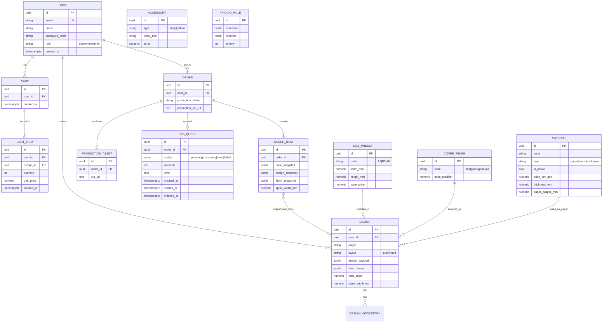

# Master Plan — Booxury (Custom Hardcover Notebook W2P Platform)

> **Konteks**: Project-based learning (Politeknik Manufaktur Bandung) + potensi produk komersial.
> **Prinsip dokumentasi**: Modular monolith — satu dokumen, bagian-bagian terpisah jelas dengan kontrak publik.
> **Prinsip teknis**: Modular monolith codebase — satu proses deploy, domain modules dengan batas tegas.

---

## 📖 Agent Onboarding (baca ini dulu di sesi manapun)

> **Tujuan**: Section ini kasih context lengkap supaya model AI (Opus/Sonnet/ apapun) bisa langsung kerja tanpa harus baca semua section lain. Butuh ~5 menit untuk onboard.

### Project Snapshot
- **Booxury**: Custom hardcover notebook Web-to-Print (W2P) platform — user desain kover online, pesan, dicetak.
- **Goal sprint ini**: MVP demo-ready untuk review dosen (Politeknik Manufaktur Bandung, Indonesia).
- **Durasi**: 7 hari (Hari 0 setup + riset + Hari 1-7 build).
- **Tanggal mulai**: **Minggu, 23 Agustus 2026** (= Hari 0).
- **Demo target**: Minggu, 30 Agustus 2026 (= Hari 7).

### Tech Stack (1 bahasa ujung ke ujung)
- **Frontend**: Next.js 15 (App Router) + Zustand + Konva.js + Tailwind CSS
- **3D Viewport**: **Pure CSS 3D + GSAP + Procedural SVG Textures** (bukan R3F/Three.js — lihat §2 untuk alasan, bundle 7× lebih kecil)
- **Backend**: Fastify (Node.js + TypeScript), 6 modular monolith modules
- **Database**: PostgreSQL + Prisma
- **PDF engine**: Sharp + PDFKit + Ghostscript (CMYK optional, MVP cukup RGB)
- **Storage**: local filesystem MVP → Cloudflare R2 production
- **Monorepo**: pnpm workspaces + Turborepo

### Folder Map (cari apa di mana)

| Cari apa | Lihat file |
|---|---|
| Requirements PRD ringkas | `planning/README.md` §1 |
| Stack + arsitektur modular monolith | `planning/README.md` §2 |
| Database schema + ERD | `planning/README.md` §3 |
| Spine formula (presisi lebar punggung) | `planning/README.md` §4 |
| API endpoints + request/response | `planning/README.md` §5 |
| Risk register + mitigasi | `planning/README.md` §6 |
| Roadmap per jam 7 hari | `planning/roadmap-sprint1.md` |
| Honest scope + anti-loop rules | `planning/README.md` §8.5 |
| Code quality bar (wajib) | `planning/README.md` §8.6 |
| Progress hari ini | `progress/Hari-N.md` (N = hari ini, 0–7) |
| Sprint summary + index + MCP tools | `progress/README.md` |
| Cumulative error log | `progress/ERRORS.md` |
| Manual smoke test log | `planning/TESTING.md` (dibuat saat sprint) |
| Riset percetakan (caliper, ICC, pricing) | `planning/percetakan-spec.md` (dibuat Hari 0) |

### Agent Convention (siapa ngapain)

- **Opus 4.6** (medium effort) — arsitek + reviewer:
  - Tulis PLAN section di `progress/Hari-N.md` pagi hari (task list + acceptance + risks)
  - Verify CHECKPOINT EOD (DoD status, carried over, besok's focus)
  - Root-cause analysis untuk error kompleks (escalation dari Sonnet)
  - Architecture decisions besar (library choice, schema design, security review)

- **Sonnet 4.6** (medium effort) — implementer:
  - Execute tasks sesuai PLAN
  - Update LOG section per task selesai (timestamp + status + commit hash)
  - Append error baru ke `progress/ERRORS.md` dengan format E001+
  - Test manual setiap endpoint/UI sebelum commit
  - **Escalate ke Opus** kalau stuck > 1 jam atau 2 attempt gagal di fix yang sama

- **Hard rule**: Opus + Sonnet TIDAK boleh cross-overlap. Sonnet tidak tulis PLAN, Opus tidak eksekusi LOG. Pisah biar accountable.

### Kapan Wajib Append ke `progress/ERRORS.md`

Setiap agent (Opus atau Sonnet) **wajib** append entry baru ke `progress/ERRORS.md` kalau encounter situasi:

| Trigger | Severity default |
|---|---|
| Build / migration / runtime error (meskipun sudah di-fix) | medium |
| Stuck 2 attempt di fix yang sama (lihat §8.5 anti-loop) | medium |
| Bug yang ditemukan saat smoke test (termasuk false positive) | medium |
| Dependency conflict (npm/pnpm peer deps) | low |
| Asumsi arsitektur yang ternyata salah di tengah jalan | high |
| Data loss / state corruption (design hilang, order corrupted) | critical |
| Security issue (auth bypass, SQL injection, XSS) | critical |
| 3rd party library breaking change / deprecation | low |

**Entry format**: lihat template di `progress/ERRORS.md` (E001, E002, ...). Wajib isi semua field (Symptom, Repro, Root cause, Fix, Files affected, Prevention, Status). Entry yang setengah jadi = debugging nanti jadi susah.

**Cek dulu sebelum mulai task baru**: baca `progress/ERRORS.md` index by type — kalau ada error type yang sama, mungkin root cause yang sama.

### MCP Tools (siapa dipakai kapan)

| MCP | Dipakai di Hari | Untuk apa |
|---|---|---|
| **Playwright** | 6, 7 | E2E test critical flows (login → wizard → cart → admin) |
| **testsprite** | 5, 6, 7 | Visual verification (3D viewport, layout regression, UI diff) |

Tools invoke via Claude Code MCP integration — agent langsung call, no manual config per session.

### Ground Rules (wajib dipatuhi)

Detail lengkap di §8.5 + §8.6. **TL;DR**:
- 7 hari = constraint keras (kalau task >2x estimate → cut ke Sprint 2, jangan extend)
- Demo-ready ≠ feature-complete (lihat §8.5 untuk definisi jujur)
- No dead code, no TODOs di committed code, no magic numbers (§8.6)
- Test before commit (catat di `TESTING.md`), conventional commit messages, 1 commit per logical change
- **Hari 0 wajib**: riset percetakan dulu SEBELUM coding (lihat `roadmap-sprint1.md` Hari 0)

### First-Time Reading Order (untuk agent baru)

1. **File ini** (`planning/README.md`) — overview + ground rules
2. **`planning/roadmap-sprint1.md`** — task breakdown per hari per jam
3. **`progress/README.md`** — sprint timeline + index + MCP tools
4. **`progress/Hari-N.md`** (N = hari ini) — current day's PLAN
5. **`progress/ERRORS.md`** — check error history sebelum mulai task baru
6. Section spesifik sesuai domain (§3 untuk schema, §4 untuk spine, §5 untuk API)

---

## Daftar Isi (TOC)

Dokumen ini adalah unified plan yang terdiri dari **8 modul** dengan kontrak publik jelas:

| # | Module | Purpose | Lihat Section |
|---|---|---|---|
| 1 | **Requirements** | PRD ringkas (sumber: `requirements_custom.odt`) | §1 |
| 2 | **Tech Stack & Architecture** | Fondasi teknologi + struktur modular monolith | §2 |
| 3 | **Data Model** | Schema database + snapshot pattern | §3 |
| 4 | **Spine Formula** | Rumus presisi lebar punggung hardcover | §4 |
| 5 | **API Contract** | Daftar endpoint + request/response shapes | §5 |
| 6 | **Risk Register** | Top 15 risiko + mitigasi konkret | §6 |
| 7 | **Roadmap 7 Hari** | Target harian + scope cuts + DoD | §7 + [`roadmap-sprint1.md`](./roadmap-sprint1.md) |
| 8 | **Methodology & SDLC** | Mini-Sprint + AI vs Manual split + Pre-sprint checklist | §8 |

**File di folder ini**:

- `README.md` (file ini) — dokumen master terpadu
- `requirements_custom.odt` — dokumen requirements asli dari dosen (jangan diedit)

---

## Module Manifest (Kontrak Publik Antar-Modul)

| Module | Tujuan | Output yang Dipakai Module Lain |
|---|---|---|
| Requirements | PRD ringkas | Input untuk semua module lain |
| Tech Stack & Architecture | Stack + struktur | Constraints untuk semua module lain |
| Data Model | Schema + ER diagram | Digunakan oleh API Contract, Implementation |
| Spine Formula | Rumus presisi | Dipakai Implementation + API Contract |
| API Contract | Endpoint shapes | Acuan frontend ↔ backend |
| Risk Register | Risks + mitigasi | Constraint untuk Roadmap |
| Roadmap | Target harian | Acuan eksekusi seluruh tim |
| Implementation Order | Urutan eksekusi | Mengacu ke semua module |

---

# 1. Module: Requirements

## Purpose
Menyimpan PRD singkat yang jadi acuan seluruh modul lain.

## Customer Facing — Interactive Product Configurator

- **Real-time Visualizer** (2D atau pseudo-3D) yang berubah saat user ganti warna/gambar/teks.
- **Drag & Drop Canvas** untuk kover depan + belakang: upload image (.jpg, .png), geser, scale, rotate.
- **Spine Text Editor** dengan batas lebar yang dikalkulasi otomatis (teks tidak boleh luber ke kover).
- **Dynamic Pricing Calculator** — update harga real-time berdasarkan fitur (contoh: kulit PU +Rp20.000, tali +Rp5.000).

## Customer Facing — E-Commerce Core

- Cart & Checkout.
- Payment Gateway (QRIS, Virtual Account, dll).
- User accounts + save for later (desain yang belum selesai).

## Manufacturer Dashboard

- **Print-Ready PDF Generator** — otomatis konversi desain kanvas RGB ke PDF siap cetak (300 DPI, CMYK, bleed).
- **Automated Bleed & Margin** — safety margin + area bleed ditambahkan otomatis meskipun user tidak melihatnya.
- **Order & Production Management**:
  - Status workflow: Menunggu Pembayaran → Masuk Antrean Cetak → Proses Jilid → Dikirim.
  - Download aset produksi per order (1 ZIP berisi: PDF Kover + PDF Isi + Lembar Spec Aksesori).
- **Inventory & Material Toggle** — admin disable material, opsi otomatis hilang di web.

## 4-Fase Wizard (User Flow)

1. **Base Configuration** — pilih ukuran (A5/B5/A6), ketebalan (50/100 lembar), kertas (HVS/Bookpaper), layout (Polos/Garis).
2. **Visual Editor Kover** (3 tab: Front, Spine, Back):
   - Upload Image dengan DPI warning.
   - Background Color & Pattern.
   - Text Tool dengan font/color + efek Emboss/Gold Foil.
   - Spine teks vertikal dengan safe zone terkunci.
3. **Material & Aksesori** — Pelapis (Doff/Glossy/Kanvas), toggle Tali + warna, toggle Pita + warna.
4. **3D Review & Pre-Flight Check** — mockup 3D, konfirmasi checklist ejaan/warna/resolusi, masuk cart.

---

# 2. Module: Tech Stack & Architecture

## Purpose
Mendefinisikan fondasi teknologi + struktur modular monolith.

## Stack Snapshot

| Layer | Pilihan |
|---|---|
| Frontend Framework | Next.js 15 (App Router) |
| 3D Engine | React Three Fiber + drei |
| Editor 2D | Konva.js (via react-konva) |
| Backend | Fastify (Node/TS) — modular monolith |
| Database | PostgreSQL + Prisma |
| Worker | Database polling (`job_queue` table, `FOR UPDATE SKIP LOCKED`) |
| PDF Engine | Sharp + PDFKit + Ghostscript |
| State | Zustand + Immer + zundo + TanStack Query |
| Form | React Hook Form + Zod |
| Storage | Cloudflare R2 / AWS S3 |
| Monorepo | pnpm workspaces + Turborepo |

**Prinsip**: 1 bahasa (TypeScript) ujung-ke-ujung, 1 database, 1 deployment model.

## Modular Monolith Architecture

**Definisi**: Aplikasi berjalan sebagai **satu proses deploy**, tapi kode dibagi jadi module independen berdasarkan domain bisnis. Menggabungkan kemudahan deploy monolith dengan kerapian struktur microservice.

### Karakteristik

- **Satu Kesatuan**: Deploy dan run sebagai satu proses (single API + single worker).
- **Batas Jelas**: Kode dibagi ke module independen (catalog, materials, configurator, pricing, production, commerce).
- **Kontrak Ketat**: Module berinteraksi via public API barrel — tidak query langsung ke tabel/internal module lain.

### 6 Domain Modules

```
apps/api/src/modules/
├── catalog/        # size_presets, cover_finishes (read-only ke public)
├── materials/      # materials + inventory toggle + admin CRUD
├── configurator/   # designs, Konva payload, finish_zones
├── pricing/        # pricing-engine delegate ke packages/pricing-engine
├── production/     # PDF worker, ZIP, spec sheet, R2 upload
└── commerce/       # cart, orders, checkout, payment webhook
```

### Aturan Inter-Module

| From → To | Boleh langsung? |
|---|---|
| `pricing` baca `materials` | ✅ via service API (read-only) |
| `commerce` baca `configurator` | ✅ via `designService.getById()` |
| `production` baca `commerce` | ✅ via service API |
| `configurator` baca `pricing` | ❌ duplicate fungsi di client package |
| `materials` baca apapun | ❌ leaf module |
| Module A query langsung tabel module B | ❌ selalu via service |

### Frontend ↔ Backend Communication

- REST/JSON via HTTPS (production) / localhost (dev).
- Auth: Bearer JWT (user). Semua endpoint custom Fastify — tanpa Medusa.
- Error format uniform (lihat §2.5).

## Project Structure

```
booxury/
├── apps/
│   ├── web/                  # Next.js 15 (frontend)
│   │   ├── app/
│   │   │   ├── (marketing)/  # SSR landing & catalog
│   │   │   ├── (auth)/       # login, register
│   │   │   ├── (account)/    # user dashboard, saved designs
│   │   │   ├── customize/    # wizard 4-fase
│   │   │   │   ├── base/page.tsx
│   │   │   │   ├── cover/page.tsx     # 3 tabs internal
│   │   │   │   ├── finish/page.tsx
│   │   │   │   └── review/page.tsx
│   │   │   ├── checkout/
│   │   │   ├── admin/        # admin custom pages
│   │   │   └── api/          # Next.js Route Handlers (BFF)
│   │   ├── components/
│   │   │   ├── configurator/ # Konva wrapper + tool panels
│   │   │   ├── preview3d/    # R3F mockup (lazy load)
│   │   │   ├── ui/           # primitive components
│   │   │   └── layout/
│   │   └── lib/
│   │       ├── stores/       # Zustand configurator
│   │       ├── api-client.ts
│   │       └── validators/   # Zod mirror backend
│   │
│   └── api/                  # Backend monolith (Fastify)
│       └── src/
│           ├── server.ts     # Fastify bootstrap
│           ├── worker.ts     # Database-queue worker (poll-based)
│           ├── modules/      # 6 domain modules
│           ├── plugins/      # auth, db, error-handler, multipart
│           ├── lib/          # logger, r2, sharp, errors
│           └── generated/    # Prisma client output
│
├── packages/                 # Shared packages (workspace)
│   ├── database/             # Prisma schema + seed + generated client
│   ├── pricing-engine/       # Pure functions, 100% tested, shared
│   ├── spine-calc/           # Spine formula (lihat §4)
│   ├── design-types/         # Zod schemas + TS types untuk Konva payload
│   ├── pdf-engine/           # Sharp + PDFKit + Ghostscript wrapper
│   └── config/               # Shared env + constants
│
├── planning/                 # docs (folder ini)
├── pnpm-workspace.yaml
├── turbo.json
└── package.json
```

### Backend Module Layout Detail

```
apps/api/src/modules/<domain>/
├── routes.ts          # atau routes.store.ts / routes.admin.ts
├── service.ts         # business logic
├── schemas.ts         # Zod input/output
├── <helpers>.ts       # validator, thumbnail, dll
└── index.ts           # public API barrel
```

### Shared Packages — Siapa Pakai Apa

| Package | Dipakai oleh |
|---|---|
| `database/` | api (semua modules), web (types only) |
| `pricing-engine/` | api (server-authoritative), web (preview) |
| `spine-calc/` | api (production worker), web (Fase 1) |
| `design-types/` | api, web (validasi) |
| `pdf-engine/` | api worker only |
| `config/` | api, web |

## Konvensi & Pattern

### File Naming

| Type | Convention | Contoh |
|---|---|---|
| Route | `routes.ts` / `routes.<scope>.ts` | `routes.admin.ts` |
| Service | `service.ts` / `<domain>.service.ts` | `design.service.ts` |
| Schema | `schemas.ts` | `schemas.ts` |
| Public API | `index.ts` (barrel) | `index.ts` |

### Error Handling

```ts
// lib/errors.ts
export class AppError extends Error {
  constructor(
    public code: ErrorCode,
    public message: string,
    public statusCode: number = 400,
    public details?: unknown
  ) { super(message); }
}

export type ErrorCode =
  | 'UNAUTHORIZED' | 'FORBIDDEN' | 'NOT_FOUND'
  | 'VALIDATION_FAILED' | 'MATERIAL_DISABLED'
  | 'DPI_TOO_LOW' | 'FILE_TOO_LARGE'
  | 'RATE_LIMITED' | 'INTERNAL_ERROR' | 'WORKER_FAILED';
```

Fastify error handler uniform → output:
```json
{ "error": { "code": "MATERIAL_DISABLED", "message": "...", "details": {} } }
```

### TS Path Aliases

```json
{
  "paths": {
    "@/*": ["./src/*"],
    "@modules/*": ["./src/modules/*"],
    "@lib/*": ["./src/lib/*"]
  }
}
```

## Requirements Mapping Matrix

Setiap requirement dari §1 dipetakan ke module yang menanganinya.

### Customer Facing — Configurator

| Requirement | Module | Implementation Location |
|---|---|---|
| Real-time Visualizer | configurator + tech-stack | Konva (2D) + R3F (3D) di Fase 2 & 4 |
| Drag & Drop Canvas | configurator | Konva Transformer di Fase 2 |
| Spine Text Editor + safe zone | configurator + spine-calc | Konva rotation + constraint |
| Dynamic Pricing | pricing | Shared pricing-engine package |
| Save for Later | configurator | `designs` table + S3 thumbnail |
| Upload Image + DPI warning | api (configurator) + sharp | Server-side validation + client warning |
| Background Color & Pattern | configurator | Konva layer + SVG pattern library |
| Text Tool + Emboss/Gold Foil | configurator | Konva shadow/highlight + annotation metadata |

### Customer Facing — E-Commerce

| Requirement | Module | Implementation |
|---|---|---|
| Cart & Checkout | commerce/cart | Custom Fastify routes |
| Payment (QRIS, VA) | commerce/payment | Midtrans adapter |
| User Accounts | commerce/auth + NextAuth | JWT + shared session |

### Manufacturer Dashboard

| Requirement | Module | Implementation |
|---|---|---|
| Print-Ready PDF (CMYK, 300 DPI) | production/pdf | Ghostscript + ICC profile |
| 3-File ZIP Output | production/archiver | PDFKit (3 file) + archiver |
| Order Status Workflow | commerce/orders | State machine |
| Material Toggle | materials | `is_active` flag + API filter |

## Strategi Anti-Lag (3D)

1. **Model buku procedural** (BoxGeometry + ExtrudeGeometry) bukan GLB — 0 KB download, presisi mm.
2. **`frameloop="demand"`** di `<Canvas>` — render hanya saat interaksi.
3. **Environment lighting** (satu HDR preset) bukan multiple point lights.
4. **`dpr={[1, 2]}`** batasi DPR iPhone dari 3 ke 2.
5. **Lazy load bundle 3D** (~600KB) — bukan di initial bundle.
6. **Proxy gambar resolusi rendah** untuk editor (1024-2048px), asli hanya untuk worker PDF.

## Strategi Pisah API ↔ Worker

Generate PDF 300 DPI = operasi 5-60 detik CPU/memory-bound. Jalankan di proses terpisah:

```
Client → API (Fastify) → INSERT job_queue → Worker (poll) → ZIP → Frontend poll status
```

API tidak boleh hang saat PDF sedang di-generate. Ini non-negotiable, bukan over-engineering.

## Kenapa Modular Monolith (Bukan Microservices)

| Pertimbangan | Modular Monolith | Microservices |
|---|---|---|
| Tim | 1-3 dev optimal | Butuh ≥5 + DevOps |
| Latency antar-module | 0 ms (in-process) | 5-50 ms (network) |
| Deploy | 1 process, atomic | N services, race condition |
| Debugging | Stack trace langsung | Tracing + correlation ID |
| Refactor | Murah (cahg module internals) | Mahal (jika salah boundary) |

Modular monolith cukup untuk 2-3 tahun ke depan. Microservices bisa di-ekstract dari module yang sudah bounded.

---

# 3. Module: Data Model

## Purpose
Definisi schema PostgreSQL + pattern snapshot untuk konsistensi produksi.

## ER Diagram



## Konvensi

- **PK**: UUID v7
- **Money**: `numeric(12,2)` IDR, never float
- **JSON**: `jsonb` + GIN index kalau query ke dalam
- **Snapshot pattern**: order_items simpan frozen copy konfigurasi saat order dibuat
- **Auth**: password di-hash dengan bcrypt (12 rounds)

## Tabel Detail (Ringkas)

### `users`

```sql
CREATE TABLE users (
  id            uuid PRIMARY KEY DEFAULT gen_random_uuid(),
  email         text UNIQUE NOT NULL,
  name          text NOT NULL,
  password_hash text NOT NULL,       -- bcrypt hash, 12 rounds
  role          text NOT NULL DEFAULT 'customer'
                  CHECK (role IN ('customer', 'admin')),
  created_at    timestamptz NOT NULL DEFAULT now()
);

-- Demo seed:
INSERT INTO users (email, name, password_hash, role) VALUES
  ('demo@booxury.local', 'Demo User', '$2b$12$...', 'customer'),
  ('admin@booxury.local', 'Admin', '$2b$12$...', 'admin');
```

### `carts`

Keranjang sementara sebelum checkout. Satu user = satu cart aktif.

```sql
CREATE TABLE carts (
  id         uuid PRIMARY KEY DEFAULT gen_random_uuid(),
  user_id    uuid NOT NULL REFERENCES users(id) ON DELETE CASCADE,
  created_at timestamptz NOT NULL DEFAULT now()
);

-- Setiap user punya 1 cart (dibuat saat user register atau first add-to-cart)
```

### `cart_items`

Item di dalam keranjang. Snapshot `unit_price` dari pricing engine saat ditambah.

```sql
CREATE TABLE cart_items (
  id         uuid PRIMARY KEY DEFAULT gen_random_uuid(),
  cart_id    uuid NOT NULL REFERENCES carts(id) ON DELETE CASCADE,
  design_id  uuid NOT NULL REFERENCES designs(id),
  quantity   int NOT NULL DEFAULT 1,
  unit_price numeric(12,2) NOT NULL,   -- snapshot, server-side calculated
  created_at timestamptz NOT NULL DEFAULT now()
);
```

### `job_queue`

Queue berbasis database untuk PDF generation (persistent, tidak hilang saat restart). Tidak butuh Redis.

> [!TIP]
> **Upgrade path ke BullMQ + Redis** — Saat aplikasi sudah komersial skala besar (100+ orders/hari), replace polling dengan BullMQ. Poll-based queue cukup untuk MVP tapi tidak efisien di skala besar karena `FOR UPDATE SKIP LOCKED` tetap membebani database. BullMQ menggunakan Redis pub/sub — event-driven, tidak ada polling. Migration: INSERT job_queue + queue.add(), polling loop + worker.on('completed').

```sql
CREATE TABLE job_queue (
  id           uuid PRIMARY KEY DEFAULT gen_random_uuid(),
  order_id     uuid NOT NULL REFERENCES orders(id),
  status       text NOT NULL DEFAULT 'pending'
                 CHECK (status IN ('pending', 'processing', 'done', 'failed')),
  attempts     int NOT NULL DEFAULT 0,
  error        text,
  created_at   timestamptz NOT NULL DEFAULT now(),
  started_at   timestamptz,
  finished_at  timestamptz
);

-- Poll: SELECT ... WHERE status = 'pending'
--         ORDER BY created_at LIMIT 1
--         FOR UPDATE SKIP LOCKED;
```

### `materials`
Bahan fisik dengan parameter presisi.

```sql
type: paper|board|endpaper
paper_caliper_mm: nullable, only for paper
is_active: inventory toggle (R3)
```

Seed awal (lihat §4.2 untuk paper caliper):

| code | type | thickness_mm | paper_caliper_mm | price (IDR) |
|---|---|---|---|---|
| HVS80 | paper | — | 0.105 | 500 |
| HVS100 | paper | — | 0.130 | 700 |
| BOOK70 | paper | — | 0.082 | 600 |
| BOOK80 | paper | — | 0.095 | 800 |
| BOARD15 | board | 1.5 | — | 1500 |
| BOARD20 | board | 2.0 | — | 2000 |
| BOARD25 | board | 2.5 | — | 2500 |
| BOARD30 | board | 3.0 | — | 3000 |
| ENDPLAIN | endpaper | 0.12 | — | 300 |
| ENDPAT | endpaper | 0.15 | — | 500 |

### `size_presets`
Ukuran standar buku.

| code | width_mm | height_mm | base_price |
|---|---|---|---|
| A5 | 148 | 210 | 35000 |
| B5 | 176 | 250 | 45000 |
| A6 | 105 | 148 | 25000 |

### `cover_finishes`
Finish kover yang ubah tekstur.

| code | name | price_modifier |
|---|---|---|
| doff | Laminasi Doff | 0 |
| glossy | Laminasi Glossy | 0 |
| canvas | Kanvas | +15000 |

### `accessories`
Aksesoris fisik (strap / ribbon).

```sql
type: strap|ribbon
color_hex: '#000000' untuk UI
color_name: 'Hitam' untuk label
```

### `pricing_rules`
Aturan harga (bukan hardcode).

```sql
condition: { "pages": { "gte": 200 } }
modifier: { "type": "percentage", "value": -10 }
       |  { "type": "fixed", "value": 5000 }
       |  { "type": "per_page", "value": 100 }
```

### `designs` — Save for Later

```sql
user_id, size_preset_id, cover_finish_id,
paper_material_id, board_material_id, endpaper_material_id,
pages, layout (plain|lined),
design_payload (Konva layers per panel),
finish_zones (foil/emboss annotations),
thumbnail_url, total_price, spine_width_mm,
status (draft|submitted|archived)
```

### `orders` — Order Head

```sql
production_status: awaiting_payment|queued|binding|shipped|cancelled
production_zip_url: di-populate setelah worker selesai
midtrans_transaction_id, midtrans_payment_type
```

### `order_items` — The Snapshot Pattern

**KRUSIAL**: Setiap field konfigurasi di-freeze di sini saat order dibuat. Setelah `payment_confirmed_at`, **immutable**.

```sql
base_snapshot: { size_code, pages, paper_code, board_code, layout }
design_snapshot: Konva layers (frozen)
finish_snapshot: { cover_finish_code, accessories: [...] }
finish_zones_snapshot: frozen
spine_width_mm: untuk PDF generator (cached)
```

### `production_assets`

```sql
cover_pdf_url, interior_pdf_url, spec_sheet_pdf_url, zip_url
generated_at, worker_metadata
```

## Snapshot Pattern — Visual

```
User klik "Tambah ke Keranjang":
  1. POST /api/price-quote → server recalculate harga
  2. Server bikin design snapshot (kalau belum ada)
  3. POST /api/cart/items → cart_items row dengan frozen unit_price
  4. Checkout → order_items.row = frozen copy dari design

Setelah payment_confirmed_at:
  User edit design (UPDATE designs SET ...)
       ↓
  design_id di order_items masih pointing ke design lama
  tapi worker baca dari *_snapshot fields di order_items
       ↓
  Hasilnya: design baru tidak affect order lama (immutable)
```

Alasan pakai snapshot:
1. User bisa edit/delete `designs` tanpa affect order yang sudah masuk produksi
2. Worker tidak perlu JOIN ke `designs` (yang mungkin sudah dihapus)
3. Audit trail jelas: "apa yang user pesan saat itu"

## Indexes

| Query Pattern | Index |
|---|---|
| Materials aktif per type | `(is_active, type)` partial WHERE is_active |
| User's designs terbaru | `(user_id, updated_at DESC)` |
| Design search Konva layer | GIN on `design_payload` |
| Admin orders by status | `(production_status)` partial WHERE IN queue/binding |

---

# 4. Module: Spine Formula

## Purpose
Acuan presisi untuk kalkulasi lebar punggung hardcover. Dipakai di Fase 1 wizard, pricing engine, dan PDF generator worker.

## Konsep Hardcover

Hardcover book tersusun dari:
1. **Cover boards** (depan + belakang) — karton keras (greyboard)
2. **Text block** — halaman isi dijilid (PUR / sewn)
3. **Endpapers** — kertas khusus perekat text block ke boards

**Spine width** = lebar punggung saat jadi. Bukan sekadar `pages × caliper` — ada komponen lain.

## Formula Final

```
spineWidthMm =
    (pages / 2) * paperCaliperMm    // text block
  + boardThicknessMm * 2            // front + back board
  + endpaperThicknessMm * 2         // 2 lembar endpaper
  + hingeAllowanceMm                // ruang tekuk endpaper
```

`pages / 2` karena hardcover jilid lembar (sheet), bukan halaman individual. 100 halaman = 50 lembar.

## Tabel Referensi

### Paper Caliper (tebal per lembar kertas isi)

| code | Paper Type | GSM | Caliper (mm/lembar) | Toleransi |
|---|---|---|---|---|
| HVS80 | HVS | 80 | 0.105 | ±0.005 |
| HVS100 | HVS | 100 | 0.130 | ±0.008 |
| BOOK70 | Bookpaper | 70 | 0.082 | ±0.005 |
| BOOK80 | Bookpaper | 80 | 0.095 | ±0.005 |

> **Catatan**: tipikal industri — wajib verifikasi dengan supplier kertas Anda sebelum produksi.

### Board Thickness (tebal karton kover)

| code | Tebal (mm) | Penggunaan |
|---|---|---|
| BOARD15 | 1.5 | Notebook tipis, jurnal kecil |
| BOARD20 | 2.0 | Hardcover standar (default) |
| BOARD25 | 2.5 | Hardcover premium |
| BOARD30 | 3.0 | Buku referensi / artbook |

### Endpaper Thickness

| code | Tebal (mm) |
|---|---|
| ENDPLAIN | 0.12 |
| ENDPAT | 0.15 |

### Hinge Allowance

| Jenis Jilid | Allowance (mm) |
|---|---|
| PUR | 2.0 |
| Sewn (benang) | 3.0 |
| Saddle Stitch | 0 (N/A) |

## Worked Examples

### Contoh 1: A5 Notebook, 100 halaman, HVS 80, PUR, board 2.0mm

```
spineWidthMm = (100 / 2) * 0.105
            + 2.0 * 2
            + 0.12 * 2
            + 2.0
            ────────────
            = 5.25 + 4.0 + 0.24 + 2.0
            = 11.49 mm

sheetWidthMm  = 148 + 11.49 + 148 + 30 + 6   = 343.49 mm
sheetHeightMm = 210 + 30 + 6                  = 246 mm
```

### Contoh 2: B5, 200 halaman, Bookpaper 80, Sewn, board 2.5mm

```
spineWidthMm = (200 / 2) * 0.095
            + 2.5 * 2
            + 0.12 * 2
            + 3.0
            ────────────
            = 9.5 + 5.0 + 0.24 + 3.0
            = 17.74 mm

sheetWidthMm  = 176 + 17.74 + 176 + 30 + 6 = 405.74 mm
sheetHeightMm = 250 + 30 + 6                 = 286 mm
```

### Contoh 3: A6 Mini, 50 halaman, Bookpaper 70, PUR, board 1.5mm

```
spineWidthMm = (50 / 2) * 0.082
            + 1.5 * 2
            + 0.12 * 2
            + 2.0
            ────────────
            = 2.05 + 3.0 + 0.24 + 2.0
            = 7.29 mm

sheetWidthMm  = 105 + 7.29 + 105 + 30 + 6  = 253.29 mm
sheetHeightMm = 148 + 30 + 6                 = 184 mm
```

## Implementasi (TypeScript)

Package: `packages/spine-calc/src/index.ts`. Dipakai oleh web (Fase 1 preview), api (order calculation), worker (PDF input).

```ts
export interface SpineInput {
  pages: number;
  paperCaliperMm: number;
  boardThicknessMm: number;
  endpaperThicknessMm: number;
  hingeAllowanceMm: number;
}

export interface SpineOutput {
  spineWidthMm: number;
  totalSheetWidthMm: number;
  totalSheetHeightMm: number;
  backPanelWidthMm: number;
  frontPanelWidthMm: number;
  bleedMm: number;
  turnInMm: number;
}

export function calculateSpine(
  input: SpineInput,
  bookDims: { widthMm: number; heightMm: number }
): SpineOutput {
  const spineWidthMm =
    (input.pages / 2) * input.paperCaliperMm +
    input.boardThicknessMm * 2 +
    input.endpaperThicknessMm * 2 +
    input.hingeAllowanceMm;

  const turnInMm = 15;
  const bleedMm = 3;

  return {
    spineWidthMm: round2(spineWidthMm),
    backPanelWidthMm: bookDims.widthMm,
    frontPanelWidthMm: bookDims.widthMm,
    totalSheetWidthMm:
      bookDims.widthMm + spineWidthMm + bookDims.widthMm
      + turnInMm * 2            // turn-in kiri + kanan
      + bleedMm * 2,            // bleed kiri + kanan
    totalSheetHeightMm:
      bookDims.heightMm
      + turnInMm * 2           // turn-in atas + bawah ← hardcover lipatan 4 sisi
      + bleedMm * 2,            // bleed atas + bawah
    bleedMm,
    turnInMm,
  };
}
```

## Validasi Input

```ts
const SPINE_LIMITS = {
  A5: { min: 5, max: 35 },
  B5: { min: 6, max: 45 },
  A6: { min: 4, max: 25 },
};

function validateSpine(spineMm: number, sizeCode: 'A5' | 'B5' | 'A6') {
  const limits = SPINE_LIMITS[sizeCode];
  if (spineMm < limits.min) return { valid: false, reason: `Terlalu tipis (${spineMm}mm)` };
  if (spineMm > limits.max) return { valid: false, reason: `Halaman terlalu banyak untuk ${sizeCode}` };
  return { valid: true };
}
```

## Verifikasi Wajib Sebelum Produksi

Software tidak bisa menggantikan physical proof untuk hardcover. Sebelum go-live:

1. Print 1 dummy book untuk setiap kombinasi (size × pages × paper × board) — minimal 9 kombinasi.
2. Ukur spine aktual vs prediksi.
3. Adjust konstanta kalau deviasi > ±0.5mm.
4. Test opening behavior (buku bisa terbuka 180° tanpa retak endpaper).
5. Simpan 1 sample per kombinasi di `planning/spine-samples/`.

## Konfirmasi yang Diperlukan dari Percetakan Mitra

- [ ] Toleransi caliper untuk tiap jenis kertas
- [ ] Board thickness options (mereka supply atau terima dari kita?)
- [ ] Default hinge allowance untuk PUR vs sewn mereka
- [ ] Endpaper pilihan atau wajib
- [ ] Turn-in default (15mm tipikal; bisa 12-20mm)

---

# 5. Module: API Contract

## Purpose
Daftar endpoint + request/response shapes. Acuan untuk frontend ↔ backend development paralel.

## Konvensi

- Base URL: `https://api.booxury.id/v1`
- Auth: Bearer JWT (user). Semua endpoint custom Fastify — tanpa Medusa.
- Content-Type: `application/json` (kecuali upload: `multipart/form-data`)
- Error format: `{ error: { code, message, details? } }`
- Money: integer IDR (no decimal separator): `"price": 35000`
- Date: ISO 8601 UTC string

## Public Endpoints (Tanpa Auth)

### Materials

```http
GET /store/materials?type=paper&active=true
```

Hanya return `is_active = true`. Admin yang disable → otomatis hilang.

Response:
```json
{
  "materials": [{
    "id": "uuid", "code": "HVS80", "name": "HVS 80gsm", "type": "paper",
    "paper_caliper_mm": 0.105, "thickness_mm": null,
    "price_per_unit": 500, "swatch_url": "..."
  }]
}
```

### Sizes

```http
GET /store/sizes
```

Response: `[{ "code": "A5", "width_mm": 148, "height_mm": 210, "base_price": 35000 }]`

### Cover Finishes, Accessories, Patterns

Endpoint pattern sama — `GET /store/cover-finishes`, `/store/accessories?type=strap`, `/store/patterns`.

## Image Upload

```http
POST /api/upload
Content-Type: multipart/form-data
Authorization: Bearer <jwt>
```

Form: `file` (jpg/png/webp), `context` (`front|spine|back`).

**Validations**: Max 25MB, allowed MIME, max 10000×10000px, DPI ≥ 100.

Response:
```json
{
  "id": "uuid",
  "url": "https://r2.booxury.id/uploads/abc123.jpg",
  "effective_dpi": 254,
  "proxy_url": ".../proxies/abc123-2048.webp",
  "warnings": [{ "code": "DPI_YELLOW", "message": "..." }]
}
```

Error codes: `FILE_TOO_LARGE`, `INVALID_MIME`, `INVALID_DIMENSIONS`, `DPI_TOO_LOW`, `PROCESSING_FAILED`.

## Preflight Check

```http
POST /api/preflight
Authorization: Bearer <jwt>
```

Body: `{ design_id, base_config, design_payload, finish_config, finish_zones }`.

Response:
```json
{
  "passed": true,
  "checks": [
    { "id": "dpi_ok", "status": "pass", "auto": true },
    { "id": "spine_safe_zone", "status": "pass", "auto": true, "details": { "spine_width_mm": 11.49, "text_width_mm": 8.3 } },
    { "id": "spine_calc_valid", "status": "pass", "auto": true }
  ],
  "spine_width_mm": 11.49,
  "estimated_price": 42500
}
```

Jika gagal: `"passed": false` + `blockers: ["dpi_ok"]`.

**Rate limit**: 10 req/menit/user.

## Price Quote (Server-Authoritative)

```http
POST /api/price-quote
Authorization: Bearer <jwt>
```

Body sama seperti preflight.

Response:
```json
{
  "subtotal": 40000,
  "breakdown": [
    { "item": "Base A5", "amount": 35000 },
    { "item": "Cover finish Kanvas", "amount": 15000 },
    { "item": "Tali Hitam", "amount": 5000 },
    { "item": "Diskon volume 5%", "amount": -2900 }
  ],
  "rule_applied": ["Diskon Hardcover Tebal"],
  "total": 40000
}
```

> **Kritis**: Harga dari client **selalu diabaikan**. Server recalculate dari `base_config` + `finish_config` + material data.

## User Designs (Save for Later)

| Endpoint | Method | Deskripsi |
|---|---|---|
| `/api/designs` | GET | List user's designs |
| `/api/designs` | POST | Save new design |
| `/api/designs/:id` | GET | Get full design (populate editor) |
| `/api/designs/:id` | PUT | Update design |
| `/api/designs/:id` | DELETE | Delete design |

Response POST:
```json
{
  "id": "uuid", "name": "Notebook A5 Custom",
  "thumbnail_url": "...",
  "total_price": 42500, "spine_width_mm": 11.49,
  "material_warnings": [
    { "code": "MATERIAL_DISABLED", "material": "BOOK70", "message": "..." }
  ]
}
```

Design tidak otomatis di-fix kalau material di-disable — user harus pilih ulang.

## Cart & Checkout (Custom Fastify — tanpa Medusa)

### Add to Cart

```http
POST /api/cart/items
Authorization: Bearer <jwt>
```

Body:
```json
{
  "design_id": "uuid",
  "quantity": 1
}
```

Server:
1. Fetch design (validasi ownership)
2. Recalculate price server-side (`POST /api/price-quote`)
3. Create/update `cart_items` row dengan `unit_price` snapshot
4. Return cart summary

### Get Cart

```http
GET /api/cart
Authorization: Bearer <jwt>
```

Response:
```json
{
  "id": "uuid",
  "items": [{
    "id": "uuid",
    "design": { "id", "name", "thumbnail_url", "base_config" },
    "quantity": 1,
    "unit_price": 42500,
    "subtotal": 42500
  }],
  "total": 42500
}
```

### Remove from Cart

```http
DELETE /api/cart/items/:id
Authorization: Bearer <jwt>
```

### Checkout

```http
POST /api/checkout
Authorization: Bearer <jwt>
```

Body (MVP simplified — tanpa shipping form):
```json
{
  "cart_id": "uuid"
}
```

Server:
1. Validate all items masih available
2. Create `orders` row
3. Snapshot `base_config`, `design_payload`, `finish_config` ke `order_items`
4. Create `job_queue` entry (status: `pending`)
5. Return `{ order_id, total }`

## Payment Webhook (Midtrans)

```http
POST /webhooks/midtrans
X-Signature: <hmac>
```

Server validate HMAC → update `production_status` ke `queued` → job sudah ada di `job_queue` dari checkout. **Idempotent** (Midtrans bisa kirim event yang sama beberapa kali).

## Admin Endpoints

| Endpoint | Method | Fungsi |
|---|---|---|
| `/admin/auth` | POST | Login admin |
| `/admin/materials/:id` | PATCH | Toggle `is_active` + stock |
| `/admin/orders` | GET | List orders (filter by status/date) |
| `/admin/orders/:id/status` | PATCH | Update `production_status` |
| `/admin/orders/:id/production-zip` | GET | Signed URL ke R2 ZIP (TTL 1 jam) |

Valid status transitions:
- `awaiting_payment` → `cancelled`
- `queued` → `binding`
- `binding` → `shipped`
- `queued` → `cancelled`

## Internal: Worker Job Payload

```ts
type PdfGenerationJob = {
  orderId: string;
  designId: string;
  baseConfig: { sizeCode, pages, paperCode, boardCode, endPaperCode, layout };
  designPayload: KonvaPayload;
  finishConfig: { coverFinishCode, accessories: [...] };
  finishZones: FinishAnnotation[];
  spineCalc: { spineWidthMm, totalSheetWidthMm, totalSheetHeightMm, bleedMm, turnInMm };
  orderNumber: string;
  customerName: string;
  placedAt: string;
};
```

Worker output: `{ coverPdfUrl, interiorPdfUrl, specSheetPdfUrl, zipUrl }`.

## Error Codes Reference

| Code | HTTP | Meaning |
|---|---|---|
| `UNAUTHORIZED` | 401 | JWT missing/invalid |
| `FORBIDDEN` | 403 | Resource milik user lain |
| `NOT_FOUND` | 404 | Resource tidak ada |
| `VALIDATION_FAILED` | 422 | Zod validation error |
| `MATERIAL_DISABLED` | 422 | Design refer material nonaktif |
| `DPI_TOO_LOW` | 422 | Image < 100 DPI |
| `FILE_TOO_LARGE` | 413 | Upload > 25MB |
| `RATE_LIMITED` | 429 | Preflight/upload spam |
| `INTERNAL_ERROR` | 500 | Server error |
| `WORKER_FAILED` | 500 | PDF generation failed (retry) |

## Versioning

- `/v1` di URL.
- Breaking changes → `/v2` + deprecate `/v1`.
- Non-breaking additions → incremental, no major bump.

---

# 6. Module: Risk Register

## Purpose
Identifikasi risiko tertinggi + mitigasi konkret agar tidak temukan blocker di tengah implementasi.

## Scoring Matrix

Likelihood × Impact (1-5). Threshold:

- **Critical (≥15)**: mitigasi sebelum mulai
- **High (9-14)**: mitigasi sebelum phase terkait
- **Medium (4-8)**: monitor
- **Low (≤3)**: accept

## Top 15 Risks

| ID | Risk | L | I | Score | Status | Owner |
|---|---|---|---|---|---|---|
| R1 | Percetakan menolak format PDF | 4 | 5 | **20** | Critical | Tech Lead |
| R2 | Color shift RGB → CMYK | 4 | 4 | **16** | Critical | Tech Lead |
| R3 | Spine width kalkulasi salah | 3 | 5 | **15** | Critical | Tech Lead |
| R4 | Font tidak ter-embed | 3 | 4 | **12** | High | Dev |
| R5 | Midtrans webhook terlewat/double-charge | 3 | 4 | **12** | High | Dev |
| R6 | 3D mockup lag di HP mid-range | 4 | 3 | **12** | High | Frontend |
| R7 | Material caliper supplier tidak sesuai | 3 | 4 | **12** | High | Operations |
| R8 | User upload file 50MB+ crash pipeline | 3 | 3 | **9** | Medium | Dev |
| R9 | Spine safe zone text overflow | 3 | 3 | **9** | Medium | Dev |
| R10 | ~~Medusa v2 module conflict~~ | N/A | — | — | ~~Medium~~ | ~~Backend~~ | Dikurangi: pure Fastify tanpa Medusa untuk MVP. |
| R11 | Database polling queue tidak efisien di skala besar | 3 | 2 | **6** | Medium | Backend | Upgrade ke BullMQ + Redis saat sudah komersial (§5 Sprint 2). |
| R11 | R2 egress cost membengkak | 2 | 3 | **6** | Medium | DevOps |
| R12 | UU PDP compliance | 2 | 3 | **6** | Medium | Legal |
| R13 | Payment provider downtime | 2 | 3 | **6** | Medium | Backend |
| R14 | Ghostscript version incompat | 2 | 3 | **6** | Medium | DevOps |
| R15 | Image upload malware abuse | 2 | 3 | **6** | Medium | Security |

## Detailed Mitigation — Top 5

### R1 — Percetakan Menolak PDF (Score 20)

**Skenario**: Setelah 8 minggu bangun, percetakan bilang "kami butuh PDF/X-4:2010 dengan specific output intent, plus spot color annotation untuk foil — format yang kamu generate tidak bisa kami pakai." → Rebuild PDF generator dari nol.

**Mitigasi**:
1. **Kontak percetakan mitra di minggu pertama** — sebelum tulis code. Tanyakan:
   - Format PDF yang mereka terima (PDF/X-1a, PDF/X-4, plain)
   - ICC profile yang mereka pakai
   - Spot color annotation — vector atau cukup marker
   - Bleed, turn-in, margin standards
   - Sample PDF dari pekerjaan sebelumnya
2. **Generate dummy PDF di minggu 2** — pakai data hardcoded, kirim, minta validasi.
3. **Document jawaban** di `percetakan-spec.md`.

**Trigger re-evaluate**: kalau minggu 2 percetakan belum bisa terima dummy PDF → **stop development**.

### R2 — Color Shift RGB → CMYK (Score 16)

**Mitigasi**:
1. **Soft proof** di editor — tampilkan simulasi CMYK (ICC profile yang sama dengan percetakan). User lihat warna "yang akan di-cetak".
2. **Konfirmasi sebelum checkout** — checklist: "warna cetak mungkin berbeda dari monitor."
3. **Test print bulanan** — kalibrasi warna dengan percetakan.
4. **Ghostscript ICC profile benar** — FOGRA39 default, atau profile dari percetakan.

### R3 — Spine Width Kalkulasi Salah (Score 15)

**Mitigasi**:
1. **Print physical proof** sebelum go-live — 1 dummy book per kombinasi. Ukur, bandingkan.
2. **Tolerance target**: deviasi < ±0.5mm.
3. **Adjust konstanta** kalau deviasi konsisten.
4. **Buffer produksi** — `+0.4mm` (0.2mm per sisi) kompensasi tekuk mesin.
5. **Sample archive** — simpan 1 sample per kombinasi.

### R4 — Font Tidak Ter-Embed (Score 12)

**Mitigasi**:
1. **Whitelist font** — hanya yang reliable: Playfair Display, Lora, Merriweather, Open Sans, Roboto, Noto Sans.
2. **Embed dengan subsetting** — PDFKit `doc.font(path)`, hanya embed glyph yang dipakai.
3. **Fallback ke path** — kalau font belum whitelist, convert text → vektor.
4. **Test otomatis** — generate PDF per font, verify `pdffonts` menunjukkan embed.

### R5 — Midtrans Webhook Terlewat (Score 12)

**Mitigasi**:
1. **Idempotency key** — `midtrans_transaction_id` sebagai unique key.
2. **Reconciliation job** — cron 30 menit cek `awaiting_payment` > 1 jam ke Midtrans API.
3. **Manual polling** — frontend panggil endpoint cek status saat kembali ke thank-you page.
4. **Webhook signature validation** — selalu validate HMAC.
5. **Retry mechanism** — Midtrans retry 5× dalam 24 jam, server handle tanpa efek samping.

## Monitoring & Detection

### Pre-Launch

- Tiap PR ubah PDF generator → generate 1 sample PDF, attach artifact untuk reviewer.
- Weekly review: cek risk baru, update skor.

### Post-Launch

- **Sentry** untuk error tracking — alert kalau rate > 1% per endpoint.
- **Job queue health** — `job_queue` rows stuck > 10 menit, count `pending` vs `completed` vs `failed`.
- **Spine accuracy check** — sample 1 order/minggu, predicted vs actual.
- **Customer complaint rate** — track retur/refund, investigate kalau > 2%.

## Review Cadence

| Tahap | Frekuensi |
|---|---|
| Implementation | Setiap 2 minggu |
| Beta (internal) | 1 minggu sekali |
| Production launch | 2 minggu sekali |
| Stabil (post-launch) | Bulanan |

Setiap perubahan major (stack baru, percetakan baru, payment provider baru) → **review risiko penuh**.

---

# 7. Module: Roadmap 7 Hari

**File terpisah**: [`roadmap-sprint1.md`](./roadmap-sprint1.md)

Dokumen lengkap berisi:

- Scope MVP (yang masuk vs yang dilewati)
- Breakdown per jam untuk setiap 7 hari
- Kode boilerplate + command yang perlu dijalankan
- Checkpoint EOD per hari
- Definition of Done (23 checklist items)
- Smoke test script 26 steps
- Risk map per hari

**Gunakan `roadmap-sprint1.md`** sebagai acuan harian saat coding. README ini hanya menyimpan ringkasan.

---

# 8. Module: Methodology & SDLC

## Purpose
Mendefinisikan cara kerja selama 7 hari sprint — metodologi, cerimoni, dan pembagian tugas AI vs manual.

## Metodologi: Mini-Sprint / Timeboxed

Untuk sprint 7 hari, Scrum standard terlalu berat. Gunakan **Mini-Sprint** dengan 3 aturan:

### Aturan Inti

1. **Frozen scope** — setelah sprint dimulai, tidak ada fitur baru masuk. Yang masuk hanya bug fix dari fitur yang sudah ada di scope.
2. **Daily standup informal (5 menit)** — cukup 3 pertanyaan: "Kemarin selesai apa? Hari ini target apa? Ada blocker?"
3. **Definition of Done (DoD) ketat** — tidak cukup "kode jalan." DoD harus:
   - Bisa diakses di browser (dev URL)
   - Tidak crash / unhandled error
   - Minimal error handling (Zod validation + try-catch)
   - Sudah di-commit dengan message ringkas

### Yang Tidak Digunakan

| Tidak Pakai | Alasan |
|---|---|
| Jira / Linear | Overhead tracking untuk 1 developer |
| Sprint planning 2 jam | Terlalu banyak ceremony untuk 7 hari |
| CI/CD pipeline otomatis | Cukup `git commit && pm2 restart` |
| Retrospektif formal | 5 menit informal sudah cukup |
| Unit test coverage target | Manual smoke test lebih baik daripada 0% coverage |

### Prinsip Berakhirnya Sprint

**Demo-ready** bukan **feature-complete**. Di hari ke-7 yang penting:
- Aplikasi bisa diakses dan-flow start-to-end
- Setiap keputusan arsitektur bisa dijelaskan ("kenapa pilih ini?")
- 1 jam sebelum demo: **freeze code, hanya polish UI**

## SDLC Scope — 5 Fase, 3 yang Dipakai

| Fase | Scope | Durasi |
|---|---|---|
| Requirements | ✅ Sudah di-lock (ODT dari dosen) | Hari 0 |
| Design | ✅ ERD review (Prisma schema) + wireframe opsional (Figma) | Hari 0 |
| Implementation | ✅ Core coding, semua 7 hari | Hari 1–7 |
| Testing | ⚠️ Manual smoke test per fase + `TESTING.md` | Ongoing |
| Deployment | ⚠️ PM2 restart script | Hari 7 |

**Setiap selesai coding fase penting: commit + test manual + catat di `TESTING.md`**

## Pembagian: AI vs Manual

AI bisa 80% coding, tapi **tidak bisa menggantikan** di area ini. Gunakan AI untuk yang repetitif, manual untuk yang strategis.

### Yang Di-Delegasikan ke AI (Boilerplate)

| Tugas | Tool | Output |
|---|---|---|
| Project scaffold (pnpm, tsconfig, eslint) | Claude Code / Cursor | Folder structure + config files |
| Fastify route handlers | Claude Code | Typed route handlers dengan Zod validation |
| React UI components (basic) | Claude Code / v0 | Functional components + CSS |
| Prisma schema generation | Claude Code | `schema.prisma` (perlu review manual) |
| SQL query drafting | Claude Code | SQL statements (perlu verify) |
| Documentation writing | Claude Code | README, docstrings |
| CSS / styling | Tailwind AI / v0 | Styled components |

### Yang Harus Manual (Tidak Di-Delegasikan Penuh)

| Tugas | Kenapa Manual | Checklist |
|---|---|---|
| **Koneksi percetakan mitra** | AI tidak bisa telepon / chat WA percetakan | Dapat specs kertas caliper aktual, ICC profile, format PDF yang diterima |
| **Architecture decisions** | AI generate tapi tidak bisa jelasin "kenapa" | Review setiap keputusan besar (Fastify, Konva, database queue) |
| **Prisma schema review** | AI generate model, tapi relasi & constraint harus dicek manual | Verifikasi foreign key, unique constraint, enum values |
| **Code review** | AI bisa salah generate, perlu manusia cek | Verify semua output AI sebelum commit |
| **Manual smoke test** | AI tidak bisa buka browser dan klik | Setiap endpoint: curl/Postman test + catat |
| **Demo prep** | Dosen tanya "kenapa ini dipilih?" | Siapkan 1-sentence explanation untuk setiap fitur utama |

## Pre-Sprint Checklist (Hari 0 — Wajib Sebelum Mulai)

> ⚠️ **Ini tidak bisa di-skip.** Kalau ini belum selesai, jangan mulai coding.

- [ ] **Hubungi percetakan mitra** — tanya: format PDF, ICC profile, bleed standar, sample pricing
- [ ] **Update spine formula** dengan caliper aktual dari percetakan (§4)
- [ ] **Update pricing** dengan harga aktual dari percetakan
- [ ] **Document hasil** di `percetakan-spec.md`
- [ ] **Setup repo** Git + initial commit
- [ ] **Setup environment** — Node 20+, pnpm, PostgreSQL, Git

## Kontribusi Personal: Yang Membuat Anda Berbeda dari AI

Kode yang bagus tapi tidak bisa dijelaskan = nilai kurang.
Kode yang cukup berfungsi tapi explained dengan conviction = nilai lebih baik.

Yang menilai di akhir (dosen) akan tanya **"kenapa kamu bikin begini?"** — dan jawaban yang bagus datang dari:
- Pemahaman domain (market hardcover Indonesia)
- Koneksi ke real-world constraints (percetakan)
- Product sense (apa yang membuat Booxury berbeda dari kompetitor)

**Ini bukan soal coding — ini soal differentiating yourself dari AI-generated code.**

---

## §8.5 Honest Scope & Anti-Loop Rules

> **Prinsip**: Demo-ready bukan feature-complete. Kejujuran tentang trade-off > over-claim. Sprint 7 hari punya batas keras, bukan aspirasional.

### Honest Scope (7 hari = MVP demo-ready)

- **7 hari = constraint keras**. Kalau task >2x estimate → **cut ke Sprint 2**, jangan extend sprint.
- **"Demo-ready"** artinya:
  - Flow end-to-end jalan tanpa crash
  - Dosen bisa klik-klik di dev URL tanpa unhandled error
  - Setiap keputusan arsitektur bisa dijelaskan 1 kalimat + trade-off
- **BUKAN** demo-ready:
  - Semua edge case handled
  - Semua error message sempurna/UX-polished
  - Semua halaman pixel-perfect responsive
  - 100% test coverage

### Anti-Loop Rules (wajib dipatuhi semua agent)

| Situasi | Tindakan |
|---|---|
| Stuck 1 jam di 1 error | Escalate Sonnet → Opus ATAU revert + workaround. Jangan stuck berjam-jam. |
| Stuck 2 attempt di fix yang sama | Stop, dokumentasikan di `ERRORS.md` sebagai known issue, move on. |
| EOD belum capai DoD | Cut task yang belum dimulai, jangan mulai task baru. |
| Hari 7 (demo)发现 ada fitur baru yang belum dibuat | **Tidak ditambah**. Cut atau acknowledged sebagai Sprint 2. |
| Diskusi berulang-ulang tanpa keputusan | Stop, ambil keputusan documented, move on. Tidak ada "looping planning". |

### Demo Day Honest Acknowledgment

Saat presentasi ke dosen, sampaikan trade-off dengan terus terang (bukan pura-pura sempurna):

- "Payment masih mock (real Midtrans di Sprint 2)"
- "CMYK belum integrated (masih RGB) — alasannya..."
- "3D pakai Pure CSS 3D bukan R3F — alasannya bundle size 7× lebih kecil"
- "Font masih 4 whitelist (Playfair, Lora, Open Sans, Roboto) — ditambah Sprint 2"

Akui tech debt di Sprint 2 wishlist. **Dosen lebih respect kejujuran + pemahaman trade-off daripada over-claim kosong.**

---

## §8.6 Code Quality Bar (wajib sebelum commit)

### Clean Code Rules

1. **No dead code**: hapus commented-out blocks, `console.log` debug, unused imports, unused variables.
2. **No TODOs/FIXMEs di committed code**: kalau belum bisa implementasi, jangan commit. Atau tulis di `ERRORS.md` sebagai known issue dengan plan.
3. **Naming convention**: `routes.ts` / `routes.<scope>.ts`, `service.ts`, `schemas.ts`, `index.ts` (barrel). Lihat §2 Konvensi.
4. **Validation**: Zod schema untuk semua API endpoint input (request + response).
5. **Error handling**: `try-catch` untuk semua I/O (file, network, database, image processing).
6. **No magic numbers**: extract ke named constants (`SPINE_LIMITS.A5.max = 35` bukan literal `35` di kode).
7. **Commit messages**: conventional (`feat:`, `fix:`, `chore:`, `refactor:`, `docs:`). Subject < 72 char, body jelaskan "kenapa".
8. **Test before commit**:
   - API endpoint: curl/Postman + catat response di `TESTING.md`
   - UI: klik manual di browser + catat di `TESTING.md`
   - Bug fix: tambah entry di `ERRORS.md` dengan symptom + fix
9. **One commit per logical change**: jangan campur 3 fitur dalam 1 commit. Lebih baik 3 commit kecil daripada 1 commit besar.

### TypeScript

- `"strict": true` di `tsconfig.json` (semua apps + packages)
- Hindari `any` — kalau terpaksa, sertakan comment kenapa (mis: "library X return type unclear, pakai any sementara")
- Prefer `unknown` + type guard (Zod schema) untuk runtime validation

### Comments

- **Jarang, tapi purposeful**. Lebih baik tidak ada comment daripada comment yang misleading.
- Comment menjelaskan **WHY**, bukan WHAT:
  - ❌ `// increment counter` untuk `counter++`
  - ✅ `// Adjust +0.4mm buffer for press machine bending tolerance (Riset percetakan 23 Agt)`
- Comment untuk public API barrel exports boleh (`// Public API — dipanggil module lain via ini`).

### Folder Structure

- **Modular monolith**: kode domain di `apps/api/src/modules/<domain>/`, **tidak** cross-import tabel/module lain.
- Package shared dipakai via `import { ... } from '@spine-calc'` — bukan copy-paste kode.
- File baru harus masuk folder yang sesuai domain. Kalau ragu, tanya Opus sebelum eksekusi.

---

# Lampiran: Status & History

## Status Implementasi

> Roadmap detail per jam: [`roadmap-sprint1.md`](./roadmap-sprint1.md)
> Nama project: **Booxury** — Custom Hardcover Notebook W2P Platform
> Repository: `booxury/` (folder root codebase)
> Metodologi: Mini-Sprint Timeboxed (§8)

| Phase | Status | Catatan |
|---|---|---|
| Planning | ✅ Selesai | |
| Riset percetakan mitra | ⬜ Belum | ⚠️ **WAJIB Hari 0** — tidak boleh coding sebelum ini (§6 R1) |
| Hari 0: Setup + Percetakan | ✅ Selesai | Monorepo + DB + PDF engine done. Percetakan research ditunda (MANUAL). |
| Hari 1: Foundation + PDF Engine | ⬜ Belum | |
| Hari 2: Pricing + Fase 1 | ⬜ Belum | |
| Hari 3: Editor Konva Part 1 | ⬜ Belum | |
| Hari 4: Editor Konva Part 2 + Fase 3 | ⬜ Belum | |
| Hari 5: Fase 4 + Cart + Checkout | ⬜ Belum | |
| Hari 6: PDF Worker + Admin | ⬜ Belum | |
| Hari 7: Polish + Demo | ⬜ Belum | |

## Gap Analysis — Status (antigravity review)

| Gap | Severity | Status | Catatan |
|---|---|---|---|
| GAP-1: Medusa vs Fastify | 🔴 Critical | ✅ Fixed | Pure Fastify, Medusa dihapus |
| GAP-2: users/carts tables missing | 🔴 Critical | ✅ Fixed | Tabel users + carts + cart_items ditambahkan |
| GAP-3: Auth di Hari 7, dibutuhkan Hari 3 | 🔴 Critical | ✅ Fixed | Auth dipindahkan ke Hari 2 |
| GAP-4: Thumbnail client vs server unclear | 🔴 Critical | ✅ Fixed | Client-side `stage.toDataURL()` di Hari 3 |
| GAP-5: Spine formula tanpa turn-in | 🟡 High | ✅ Fixed | Turn-in ditambahkan di width & height |
| GAP-6: In-memory queue | 🟡 High | ✅ Fixed | Database `job_queue` table dengan FOR UPDATE SKIP LOCKED |
| GAP-7: Admin role missing | 🟡 High | ✅ Fixed | `role` field di tabel users |
| GAP-8: No pagination | 🟡 Medium | ⬜ Deferred | Sprint 2 |
| GAP-9: No .env documented | 🟢 Medium | ⬜ Deferred | Sprint 2 |
| GAP-10: Storage adapter | 🟢 Medium | ⬜ Deferred | Sprint 2 (local filesystem MVP) |
| GAP-11: Concurrent edit conflict | 🟢 Medium | ⬜ Deferred | Sprint 2 (version field) |
| GAP-12: Payload size limit | 🟢 Medium | ⬜ Deferred | Sprint 2 (2MB limit) |

## Update Riwayat

- **2026-08-21** — Master plan dibuat dengan 7 module terpadu (Requirements, Tech Stack, Data Model, Spine Formula, API Contract, Risk Register, Roadmap)
- **2026-08-21** — 12 gap analysis dari antigravity diverifikasi dan diperbaiki (GAP-1 s/d GAP-7)
- **2026-08-21** — Queue strategy: BullMQ -> database polling untuk MVP (§2, §6 GAP-6, R11). Upgrade path ke BullMQ + Redis saat komersial.
- **2026-08-21** — Project rename: hardcover_custom → **Booxury**. Ditambahkan §8 Methodology & SDLC: Mini-Sprint Timeboxed, AI vs Manual split, Pre-sprint checklist Hari 0.

## File Pendukung

- `requirements_custom.odt` — dokumen requirements asli dari dosen (jangan diedit, source of truth)
- `gap-analysis.md` — review gap analysis dari antigravity (historically, semua gap sudah diperbaiki)
- `DOKUMEN_PROJECT_MANAGER.md` — dokumen project manager asli (referensi)
- `roadmap-sprint1.md` — detail sprint 7 hari dengan breakdown per jam
- `percetakan-spec.md` — **HARUS DIBUAT di Hari 0** — hasil riset dari percetakan mitra (kalau belum ada, sprint tidak boleh mulai)
- `TESTING.md` — **HARUS DIBUAT selama sprint** — catat setiap test manual yang dijalankan